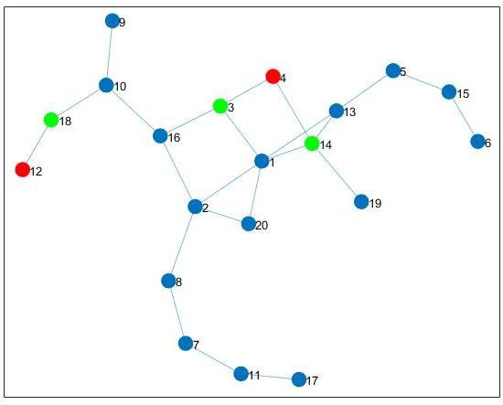

# Blinking Effect on Synchronization Control

This repository contains the MATLAB implementations developed for the study "Blinking effect on synchronization control". The project explores the synchronization of a specific subset of nodes within a dynamical network using time-varying (blinking) controllers.

## Project Overview
The research focuses on a network of **20 identical Chua's Oscillators** connected by 23 edges. The main goal is to achieve synchronization between **Node 4** and **Node 12**. While the original network does not reach global synchronization, the application of an additional layer of "blinking" links—based on a specific mathematical theorem—allows these target nodes to synchronize their trajectories.

<table>
  <tr>
    <td></td>
    <td></td>
  </tr>
  <tr>
    <td align="center"><b>Original Network</b></td>
    <td align="center"><b>Network with Blinking Links</b></td>
  </tr>
</table>

## Mathematical Model
Each node in the network is a chaotic Chua's oscillator defined by the following dimensionless equations:

$$
\dot{x}_{1} = \alpha(x_{2} - x_{1} + g(x_{1}))
$$

$$
\dot{x}_{2} = x_{1} - x_{2} + x_{3}
$$

$$
\dot{x}_{3} = -\beta x_{2} - \gamma x_{3}
$$

**Simulation Parameters:**
* **Oscillator constants**: $\alpha=10$, $\beta=15$, $\gamma=0.0385$.
* **Non-linear function $g(x_1)$**: $a=-1.27$, $b=-0.68$.
* **Coupling strength ($\sigma$)**: 2.

## Repository Content
The repository includes two main simulation scripts that implement the **Blinking Effect** in different ways:

### 1. chua_oscillators_fixed_laplacian
In this implementation, an augmented Laplacian matrix ($L''$) containing the control links is created *a priori*. During the simulation, the controller switches the entire coupling configuration between the original state ($L$) and the augmented state ($L''$) based on a probability $p$.

### 2. chua_oscillators_unfixed_laplacian
In this version, the control links are generated dynamically. Each potential link in the control layer ($L'$) is independently activated or set to zero at each time step with a probability $p$.

## How to Run
1. Open MATLAB.
2. Run either script to start the simulation.
3. The simulation will iterate through a probability vector (typically `logspace(-2, 0, 21)`) to evaluate the effect of $p$ on synchronization.

## Results and Metrics
The scripts generate plots for:
* **Global Error**: The overall synchronization error of the 20-node network.
* **Synchronization Error (Nodes 4 & 12)**: The specific error between the two nodes targeted for control.
* **Average Error vs. Probability**: A semilogarithmic chart showing how the synchronization error decreases as the blinking probability $p$ increases.

## References
* [1] M. Frasca, L. V. Gambuzza, A. Buscarino, L. Fortuna, "Synchronization in Networks of Nonlinear Circuits", Springer 2018.
* [2] Gambuzza, L. V., Frasca, M., & Latora, V. (2019). Distributed control of synchronization of a group of network nodes. IEEE Transactions on Automatic Control, 64(1), 362-369.

---
*Implementation based on the Bachelor's Thesis by Carmelo Pirosa (2019), Università degli Studi di Catania.*
